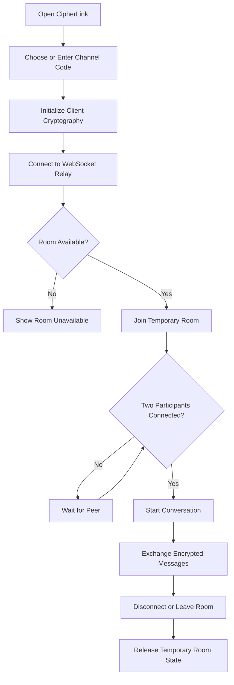
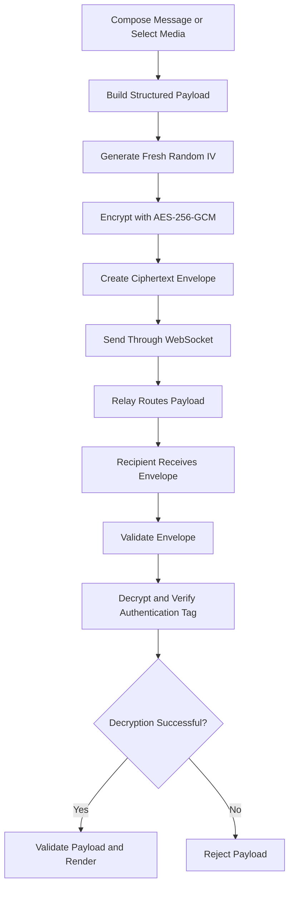
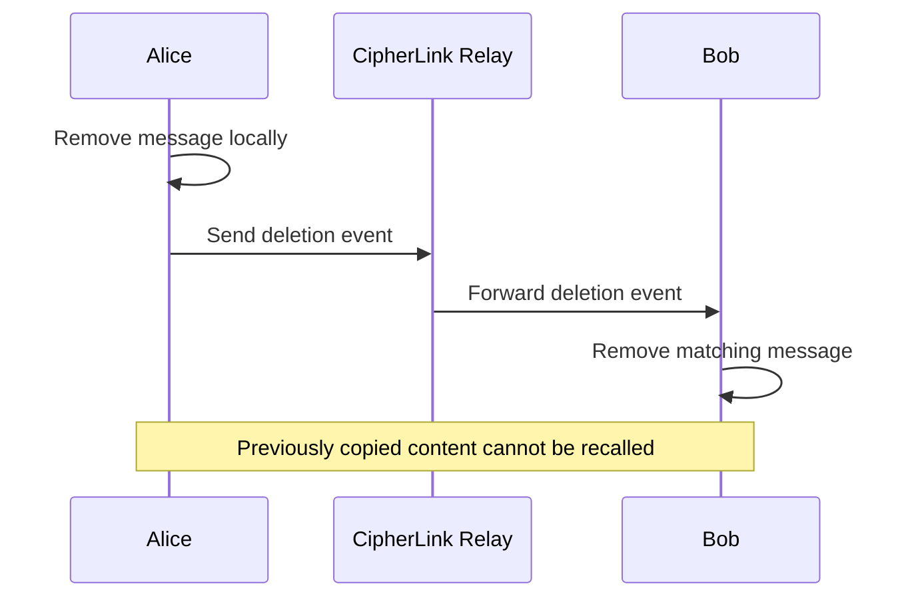

 <p align="center">
  <a href="https://github.com/Devputta/CipherLink-">
    
  </a>
</p>

<p align="center">
  <strong>CipherLink — Private, Accountless Encrypted Messaging</strong>
</p>

<p align="center">
  <strong>
    A browser-based messaging application for two participants,
    featuring client-side encryption, ephemeral chat rooms,
    encrypted media sharing, and self-destructing messages.
  </strong>
</p>

<p align="center">
  <a href="https://github.com/Devputta/CipherLink-">
    
  </a>
  
  
  
  <a href="LICENSE.md">
    
  </a>
</p>

---

# 🔐 Overview

**CipherLink** is a browser-based, accountless messaging application designed for private communication between two participants.

Instead of requiring traditional accounts, email addresses, or phone numbers, CipherLink allows users to establish a temporary conversation using a shared channel code.

Messages and supported media are encrypted in the browser before transmission. A WebSocket relay forwards encrypted payloads between connected participants without needing access to the encryption key.

The project focuses on a simple principle:

> Private communication should not require creating an account or maintaining a permanent messaging history.

CipherLink combines browser-native cryptography, real-time communication, temporary chat rooms, and a minimal interface to create a lightweight messaging experience.

## 🌐 Project Links

| Resource                | Link                                                                                               |
| ----------------------- | -------------------------------------------------------------------------------------------------- |
| **Live Application**    | [Open Production App](https://ais-pre-xgapdwv2v4x4vtfeir6rax-708468648854.asia-east1.run.app)      |
| **Development Preview** | [Open Development Preview](https://ais-dev-xgapdwv2v4x4vtfeir6rax-708468648854.asia-east1.run.app) |
| **Source Repository**   | [GitHub Repository](https://github.com/Devputta/CipherLink-)                                       |
| **Deployment Guide**    | [DEPLOYMENT.md](DEPLOYMENT.md)                                                                     |
| **Security Policy**     | [SECURITY.md](SECURITY.md)                                                                         |
| **License**             | [LICENSE.md](LICENSE.md)                                                                           |

---

# ✨ Features

## 💬 Accountless Messaging

CipherLink is designed to make temporary conversations straightforward.

* No conventional account registration.
* No email or phone number required to start a conversation.
* Temporary screen aliases.
* Shared numeric channel codes.
* Real-time messaging over WebSocket connections.
* A maximum of two active participants per room.
* Connection and disconnection notifications.

## 🔒 Client-Side Encryption

CipherLink uses the browser's Web Crypto API to encrypt message content before it reaches the relay.

The intended cryptographic workflow includes:

* PBKDF2-HMAC-SHA-256 key derivation.
* AES-256-GCM authenticated encryption.
* A fresh, randomly generated initialization vector for each encryption operation.
* Authentication-tag verification during decryption.
* Local handling of encryption keys.

The relay is designed to forward ciphertext rather than plaintext message content.

**Important:** The actual security guarantees depend on the implemented key derivation, room authentication, transport security, and deployment configuration. A shared numeric PIN alone does not guarantee that only the intended participants can derive a key.

## 🖼️ Encrypted Media Sharing

Participants can exchange supported media and documents through the messaging interface.

Supported content includes:

* Images and photographs.
* Short video clips.
* PDF documents.
* Text messages with captions.

The intended media flow is:

1. The sender selects a file.
2. The browser prepares the content for transmission.
3. The client encrypts the payload.
4. The encrypted data is transmitted through the relay.
5. The recipient decrypts the payload locally.
6. The interface renders the supported media.

Large media files require appropriate size limits, memory management, and message-fragmentation or streaming strategies.

## ⏳ Ephemeral Messages

CipherLink supports temporary-message functionality.

* Optional automatic deletion after a configured duration.
* Manual message deletion.
* Synchronization of deletion events between connected clients.
* Temporary room membership.
* In-memory relay state.

Deletion removes the relevant message from the application views, subject to the implementation.

It cannot guarantee erasure of screenshots, downloads, copied content, browser caches, or data independently retained by a recipient.

## 👥 Two-Person Rooms

Each room is intended for two connected participants.

```text
Alice ───────┐
             ├── CipherLink Room
Bob ─────────┘
```

Room management is designed to provide:

* Channel-based participant matching.
* Room-capacity enforcement.
* Peer-joined notifications.
* Peer-disconnected notifications.
* Typing indicators.
* Temporary connection state.

Additional server-side authorization and rate limiting are important because a numeric channel code is not, by itself, a strong authentication mechanism.

## 🎨 User Experience

CipherLink is designed to support:

* Light and dark themes.
* Responsive desktop, tablet, and mobile layouts.
* Inline image previews.
* Video playback controls.
* PDF document viewing.
* Optional synthesized sound cues.
* Configurable message-expiration controls.
* Clear connection and delivery states.

The interface prioritizes readability, quick access to conversations, and minimal setup.

---

# 🛡️ Privacy & Security Model

CipherLink aims to minimize the amount of information that must pass through its relay infrastructure.

| Area                       | Intended behavior                                       |
| -------------------------- | ------------------------------------------------------- |
| Account registration       | Not required for temporary conversations                |
| Message encryption         | Performed in the browser                                |
| Relay message access       | Encrypted payloads only                                 |
| Persistent message history | Not intended to be maintained by the relay              |
| Room capacity              | Maximum of two active participants                      |
| Encryption keys            | Derived or handled locally                              |
| Message deletion           | Client-side removal with peer notification              |
| Third-party analytics      | No analytics should be included unless explicitly added |

### Privacy boundaries

A privacy-focused design still has practical limits:

* The server can potentially observe IP addresses, connection times, room identifiers, message sizes, and traffic patterns.
* A compromised application server could serve malicious JavaScript that attempts to access messages or encryption material.
* Weak room codes can be guessed without adequate protections.
* Message deletion cannot erase recipient-controlled copies.
* Browser extensions and compromised devices may expose decrypted content.
* Hosting providers may retain infrastructure or access logs independently of application behavior.

For these reasons, privacy and security claims should be verified against the source code and production configuration.

---

# 📐 System Architecture

CipherLink separates the user interface, browser-side cryptographic operations, and message relay.

```text
┌─────────────────────┐
│     Alice's UI      │
│                     │
│ Text / Media Input  │
└──────────┬──────────┘
           │
           ▼
┌─────────────────────┐
│ Client Crypto Layer │
│                     │
│ Key Derivation      │
│ AES-GCM Encryption  │
└──────────┬──────────┘
           │
           │ Encrypted Payload
           ▼
┌─────────────────────┐
│  WebSocket Relay    │
│                     │
│ Room Management     │
│ Participant Routing │
└──────────┬──────────┘
           │
           │ Encrypted Payload
           ▼
┌─────────────────────┐
│ Client Crypto Layer │
│                     │
│ AES-GCM Decryption  │
│ Payload Validation  │
└──────────┬──────────┘
           │
           ▼
┌─────────────────────┐
│      Bob's UI       │
│                     │
│ Render Message      │
└─────────────────────┘
```

The relay coordinates delivery but should not require the shared encryption key to route messages.

## 🔄 Connection Flow



## 🔐 Message Encryption Flow



---

# 🔑 Cryptographic Specifications

The following table describes the cryptographic approach documented for CipherLink. These parameters should be checked against the current implementation before being treated as verified production settings.

| Property                   | Intended implementation          |
| -------------------------- | -------------------------------- |
| Symmetric encryption       | AES-256-GCM                      |
| Key size                   | 256 bits                         |
| Authentication tag         | 128 bits                         |
| Initialization vector      | 96 bits, freshly generated       |
| Key derivation             | PBKDF2-HMAC-SHA-256              |
| Documented iteration count | 120,000                          |
| Cryptography interface     | W3C Web Crypto API               |
| Random number generation   | `crypto.getRandomValues()`       |
| Message transport          | WebSocket over TLS in production |

### Key derivation considerations

A numeric PIN has limited entropy. Even when a strong cryptographic algorithm is used, a predictable or short PIN may be vulnerable to offline guessing if an attacker obtains the information needed to test candidate keys.

A production implementation should consider:

* A high-entropy shared secret or a suitable password-based key exchange design.
* Per-conversation salt and context separation.
* A key-derivation work factor selected using current security guidance and device performance.
* Protection against online channel-code guessing.
* Clear separation between encryption keys and room-routing identifiers.

A fixed salt based on the room PIN does not provide the same benefits as a unique random salt.

---

# 📨 Message & Media Data Flow

The message envelope should contain only the metadata needed to transport and decrypt the payload.

Conceptual example:

```json
{
  "type": "encrypted-message",
  "id": "message-id",
  "iv": "base64-encoded-random-iv",
  "data": "base64-encoded-ciphertext"
}
```

This is an illustrative structure, not a guarantee of the exact envelope currently implemented.

### Sender responsibilities

* Validate message and file sizes.
* Construct a supported payload.
* Encrypt sensitive content before transmission.
* Generate a fresh IV for every encryption operation.
* Handle encryption errors without sending plaintext as a fallback.

### Relay responsibilities

* Validate message structure and size.
* Identify the destination room.
* Forward opaque encrypted payloads.
* Enforce participant limits.
* Apply rate limits and connection safeguards.
* Avoid intentionally persisting message content.

### Recipient responsibilities

* Validate the envelope.
* Decrypt using the expected key.
* Reject authentication failures.
* Validate the decrypted payload schema.
* Render content safely without interpreting untrusted input as executable HTML.

---

# 🗑️ Message Deletion Flow



Message deletion should be treated as a synchronization feature rather than a cryptographic guarantee of irreversible data destruction.

A robust implementation should validate message ownership, scope deletion events to the correct room, and prevent arbitrary deletion of another participant's messages.

---

# 🧩 Core Modules

| Module                 | Responsibility                                      |
| ---------------------- | --------------------------------------------------- |
| **Messaging UI**       | Conversation display, composer, and message actions |
| **Crypto Layer**       | Key derivation, encryption, and decryption          |
| **Media Handler**      | File validation, serialization, and previews        |
| **WebSocket Client**   | Connection lifecycle and message transport          |
| **Relay Server**       | Room membership, routing, and capacity limits       |
| **Room Manager**       | Temporary room state and participant tracking       |
| **Presence System**    | Typing indicators and connection events             |
| **Expiration Manager** | Message-expiration behavior                         |
| **Theme System**       | Light and dark appearance                           |
| **Error Handling**     | Safe handling of network and cryptographic failures |

---

# 🛠️ Technical Stack

The following technologies are referenced by the documented architecture. Confirm the exact framework and dependency versions against `package.json` and the server implementation.

### Browser Application

* HTML, CSS, and JavaScript or TypeScript.
* Web Crypto API.
* WebSocket API.
* File and Blob APIs.
* HTML5 video and document-viewing capabilities.
* Web Audio API for optional sound effects.

### Cryptography

* AES-256-GCM.
* PBKDF2-HMAC-SHA-256.
* Secure browser-generated random values.

### Communication

* WebSocket for real-time message delivery.
* TLS-protected WebSocket connections (`wss://`) in production.

### Deployment

* Environment-specific configuration.
* Production and development environments.
* Render or Vercel where compatible with the chosen server architecture.

---

# 🚀 Deployment

CipherLink has documented production and development endpoints.

* **Production:** [Open CipherLink](https://ais-pre-xgapdwv2v4x4vtfeir6rax-708468648854.asia-east1.run.app)
* **Development:** [Open Preview](https://ais-dev-xgapdwv2v4x4vtfeir6rax-708468648854.asia-east1.run.app)

For deployment instructions and environment configuration, see [DEPLOYMENT.md](DEPLOYMENT.md).

### Production checklist

* Use HTTPS and secure WebSocket connections.
* Validate room identifiers and message envelopes.
* Enforce two-participant room limits on the server.
* Apply connection and message rate limits.
* Set maximum text and media payload sizes.
* Configure restrictive Content Security Policy headers.
* Avoid logging message bodies or cryptographic material.
* Keep secrets and environment-specific configuration out of Git.
* Test reconnection, concurrent joins, and room cleanup.
* Verify that the hosting platform supports the application's WebSocket requirements.

---

# 🧪 Testing & Verification

Security-sensitive behavior should be tested independently of the user interface.

Recommended test coverage includes:

* Encryption and decryption round trips.
* Detection of modified ciphertext.
* Rejection of invalid IVs and malformed envelopes.
* Independent keys failing to decrypt one another's messages.
* Third-participant rejection.
* Concurrent room-join handling.
* Room cleanup after disconnection.
* Message-expiration behavior.
* Deletion-event authorization.
* Oversized-file rejection.
* Safe rendering of untrusted text and filenames.
* WebSocket reconnection and network failures.

Do not publish a passing-test badge or claim an independent security audit unless the relevant test results or audit report are available.

---

# 🔒 Security Policy

Security reporting and disclosure guidance should be maintained in **[SECURITY.md](SECURITY.md)**.

The security policy should document:

* Supported versions.
* Vulnerability-reporting instructions.
* Expected response timelines.
* Cryptographic design assumptions.
* Threat model and out-of-scope risks.
* Dependency and deployment security practices.

CipherLink's use of AES-GCM and the Web Crypto API does not, by itself, establish that the complete application has been independently audited or is immune to attacks.

---

# 📁 Repository Structure

The precise structure depends on the current repository. A possible organization for the documented architecture is:

```text
CipherLink/
│
├── public/
│   └── assets/
│
├── src/
│   ├── components/
│   │   ├── ChatWindow
│   │   ├── MessageComposer
│   │   ├── MessageBubble
│   │   ├── MediaPreview
│   │   └── ConnectionStatus
│   │
│   ├── crypto/
│   │   ├── keyDerivation
│   │   ├── encrypt
│   │   └── decrypt
│   │
│   ├── messaging/
│   │   ├── websocketClient
│   │   ├── messageValidation
│   │   └── expiration
│   │
│   ├── lib/
│   │   └── configuration
│   │
│   └── styles/
│
├── server/
│   ├── websocketServer
│   ├── roomManager
│   └── rateLimiter
│
├── tests/
│   ├── crypto
│   ├── messaging
│   └── rooms
│
├── .env.example
├── .gitignore
├── DEPLOYMENT.md
├── SECURITY.md
├── LICENSE.md
└── README.md
```

This is a reference structure, not a verified inventory of the existing GitHub repository.

---

# 📱 Responsive Experience

CipherLink is intended to support:

```text
Desktop
   │
   ├── Full conversation layout
   ├── Keyboard input
   └── File selection
        │
        ▼
Tablet
   │
   ├── Adaptive message layout
   └── Touch interactions
        │
        ▼
Mobile
   │
   ├── Compact conversation view
   ├── Touch-friendly composer
   ├── Media previews
   └── Connection status
```

The interface should preserve access to essential messaging controls on small screens without reducing message readability or hiding important connection states.

---

# 🎯 Design Principles

### Privacy by Design

Minimize unnecessary collection and retention of user information.

### Client-Side Encryption

Encrypt message content before transmission and reject failed decryption rather than silently falling back to plaintext.

### Minimal Persistence

Keep temporary conversation state short-lived and document any unavoidable infrastructure logs.

### Defensive Validation

Validate incoming data, file sizes, room membership, and message operations on both the client and server.

### Honest Security Claims

Document what has been implemented and tested separately from intended behavior and future improvements.

### Human-Centered Interface

Prioritize clear communication states, understandable errors, responsive layouts, and functional controls over decorative effects.

---

# 👤 Project Maintainer

**CipherLink** is maintained by **[Devputta](https://github.com/Devputta)**.

* **Repository:** [github.com/Devputta/CipherLink-](https://github.com/Devputta/CipherLink-)
* **Application:** [CipherLink Live](https://ais-pre-xgapdwv2v4x4vtfeir6rax-708468648854.asia-east1.run.app)

---

# 📄 License

CipherLink is intended to be distributed under the **MIT License**, as referenced by the project's license documentation.

See [LICENSE.md](LICENSE.md) for the complete license text.

---

<p align="center">
  <strong>CipherLink</strong>
  <br />
  Private conversations. Minimal traces. No unnecessary accounts.
</p>

<p align="center">
  <em>Connect privately. Communicate securely.</em>
</p>
